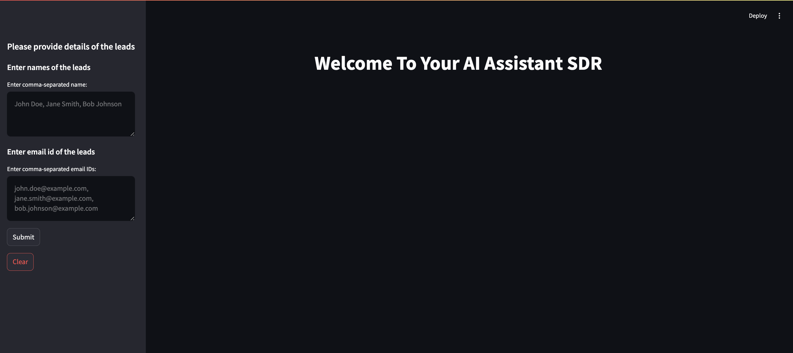

# SDR
Automated Sales Debelopment Represenative to send automatic personalised cold emails to the leads

This is a sample repo for creating a streamlit application that take name and email id of the leads and using grok and llama it generates personalised email to leads for a product FOSFOR by LTIMINDTREE

To run the application in local follow the below steps:-
1. Git clone the repo
2. Create a virtual env
3. install all the packages in requirement.txt
4. run the application using streamlit run app.py from the directory sdr